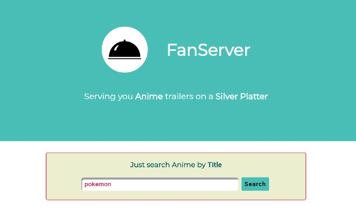
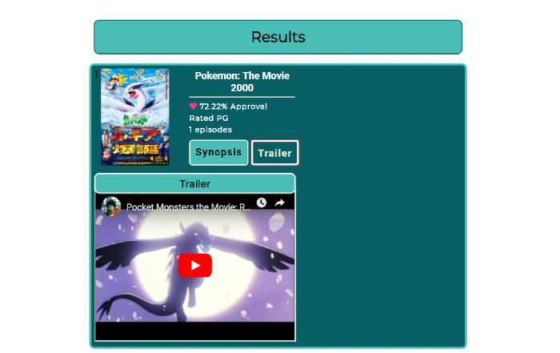

# FanServer-app
Search a database of anime series titles/view trailers

## Author
Kyle Knutson 
[Portfolio](https://punchycoder.github.io/Kyle-Knutson-Portfolio/)

## Screen Shots of FanServer

Main page-top:

---

Main Page-Results:

---

## Built with
* HTML5
* CSS
* JavaScript
* jQuery

## Live App
[Check it out](https://punchycoder.github.io/FanServer-app/)

## Struggles
* Adding basic toggle funcion to syopsis-display on button click. The key was to use <code>event.stopImmediatPropagation</code>... google it.
* Looked all over for a way to make container grow to fit content in CSS; found <code>width: fit-content</code> ...Simply amazing. 
* Figured out the synopsis/trailer button event-logic was a pain. I wasn't referencing the right element in jQuery; code needs refinement.
* Because Kitsu API doesn't have a youtubeVideoId for all Anime titles, some results display an "trailer missing" message.
* I tried using Google's Youtube API, however, the query cost is 100 per request. At a query cap of 10,000 and with 10 requests (cost of 1000) per search, I found it unsustainable.
* More struggles coming soon.

 

## Tasks
* ~~__Synopsis-button expands card & displays synopsis when clicked__~~
* ~~__Trailer button expands card & displays trailer when clicked__~~
* ~~__Trailer-button hides Synopsis and vise versa__~~
* ~~__Fetchs video forEach resulting title__~~
* ~~__If video/trailer not available => display error message => stand-in image?__~~
* ~~__Limit synopsis verbosity? => add "read more" link/button.__~~
* ~~__Responsiveness__~~
* ~~__Error logic for absent video IDs__~~
* __Stuff...__

## Abandoned Feature(s)
* Search with Google's Youtube API (search list)
* Add search by genre?
  * add input
  * add search param
  * find genre endpoint(s)
  * list genres searched 
  * display pills
  

